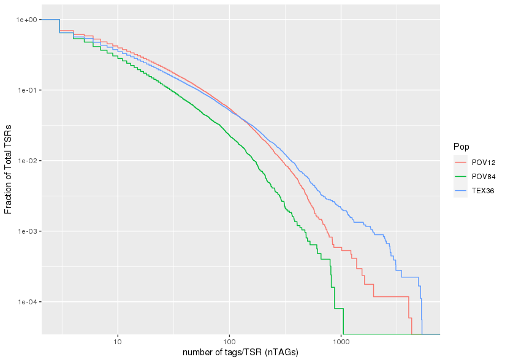

### Plotting the distribution of tags per TSR and STRIPE-seq

#####Let's import the datasets:

`POV84_3thresh <- read.table(file="TSRchitect_TSSthresh3_files/POV84_TSRset.txt",header=TRUE)`
`TEX36_3thresh <- read.table(file="TSRchitect_TSSthresh3_files/TEX36_TSRset.txt",header=TRUE)`
`POV12_3thresh <- read.table(file="TSRchitect_TSSthresh3_files/POV12_TSRset.txt",header=TRUE)`

#####Adding a new column to the tables
`POV84_3thresh$Pop <- "POV84"`
`TEX36_3thresh$Pop <- "TEX36"`
`POV12_3thresh$Pop <- "POV12"`

#####Combining the three datasets:
`combined_table <- rbind(POV12_3thresh, POV84_3thresh, TEX36_3thresh)`

#####Plotting the reverse cumulative distribution of the TSRs
`ggplot(combined_table, aes(as.numeric(nTAGs), colour=Pop)) + geom_step(aes(y = 1 - ..y..), stat='ecdf') + scale_x_log10() + scale_y_log10() + labs(y="Fraction of Total TSRs", x = "number of tags/TSR (nTAGs)")`
`png(file="Dpulex_TSRs_nTAGs_RevCumulPlot.png")`

#####Here's the plot:

#####Calculating the quantile distribution
`quantile.pov84 <- quantile(as.numeric(POV84_3thresh$nTAGs), probs = seq(0,1,0.1))`
`quantile.pov12 <- quantile(as.numeric(POV12_3thresh$nTAGs), probs=seq(0,1,0.1))`
`quantile.tex36 <- quantile(as.numeric(TEX36_3thresh$nTAGs), probs=seq(0,1,0.1))`

#####Let's explore the quantile results for each:
`quantile.pov84`
#the 90% quantile begins at 30 tags
`quantile.pov12`
#the 90% quantile begins at 57 tags 
`quantile.tex36`
#the 90% quantile begins at 52 tags

#####Comparison of top 90% genes (currently in progress):

`POV84_top10pc <- POV84_3thresh[POV84_3thresh$nTAGs>=30,]`
`POV12_top10pc <- POV12_3thresh[POV84_3thresh$nTAGs>=57,]`
`TEX36_top10pc <- TEX36_3thresh[TEX36_3thresh$nTAGs>=52,]`

`POV84_top_genes <- na.omit(POV84_top10pc$featureID)`
`POV12_top_genes <- na.omit(POV12_top10pc$featureID)`
`TEX36_top_genes <- na.omit(TEX36_top10pc$featureID)`

